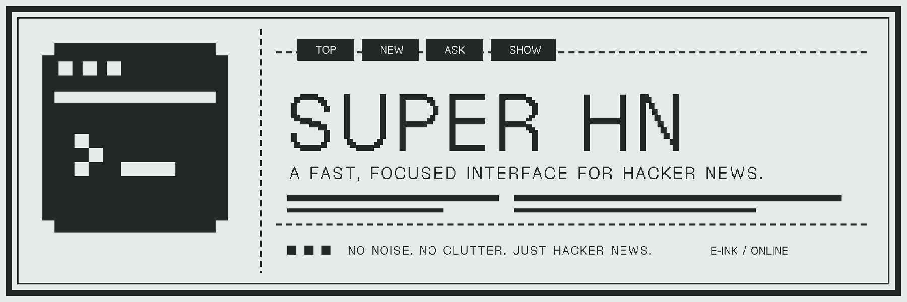
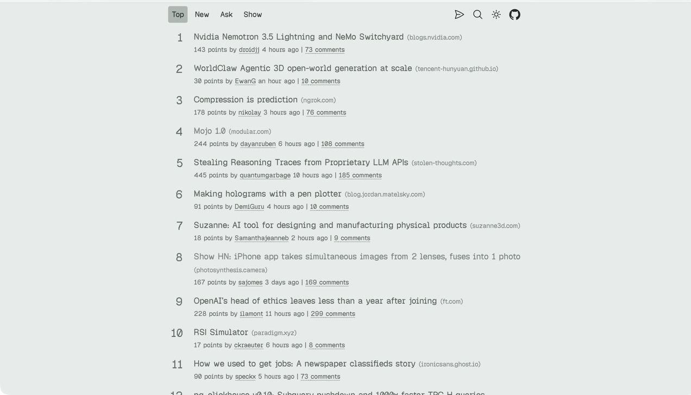

# Super HN

Super HN is a fast, focused, and responsive interface for browsing Hacker News, built with the Next.js App Router.



- [Live application](https://super-hacker-news.vercel.app)
- [Source repository](https://github.com/motheki/super-hacker-news)
- [Issue tracker](https://github.com/motheki/super-hacker-news/issues)

## Features

- Top, new, Ask HN, and Show HN feeds
- Story pages with nested, collapsible comment threads
- Hacker News user profiles with links to submissions, comments, and favorites
- Automatic light and dark themes that follow the system preference
- Native sharing where supported, Hacker News search, and responsive navigation
- Installable app metadata, crisp browser and home-screen icons, and route-level loading states

## Preview



## Development

Install dependencies with [Bun](https://bun.sh), then start the Next.js development server:

```sh
bun install
bun run dev
```

Before submitting changes, run:

```sh
bun run lint
bun run test
bun run build
```

## Architecture

The application uses the Next.js App Router and React Server Components by default. Route-level `loading.tsx`, `error.tsx`, and `not-found.tsx` boundaries handle navigation states. Public API reads use Cache Components with `use cache`, explicit `cacheLife` policies, and cache tags; Partial Prefetching reuses route shells while selected topic links resolve URL-specific data ahead of navigation. Client components are limited to interactive UI islands.

See [Architecture and design](docs/architecture.md) for the current route map, data flow, caching strategy, E-ink theme, and icon support.

## Browser icons

The favicon is an opaque 1-bit pixel terminal drawn in the site text color (`#242927`) on the same `#e6ebe9` E-ink canvas as the light theme. Explicit, versioned App Router metadata URLs prevent Safari from retaining earlier site artwork. The icon set includes SVG and multi-resolution ICO browser icons, a 32 px Safari raster icon, an Apple touch icon, mask-safe 192 px and 512 px web app icons, and a dedicated monochrome pinned-tab mask.

## Attribution

Super HN is based on [Better HN (Better Hacker News)](https://github.com/pajecawav/better-hn) by [pajecawav](https://github.com/pajecawav). The original project's copyright notice and MIT license are preserved in this repository.

## License

Super HN is distributed under the [MIT License](LICENSE), inherited from the original [Better HN license](https://github.com/pajecawav/better-hn/blob/master/LICENSE).
